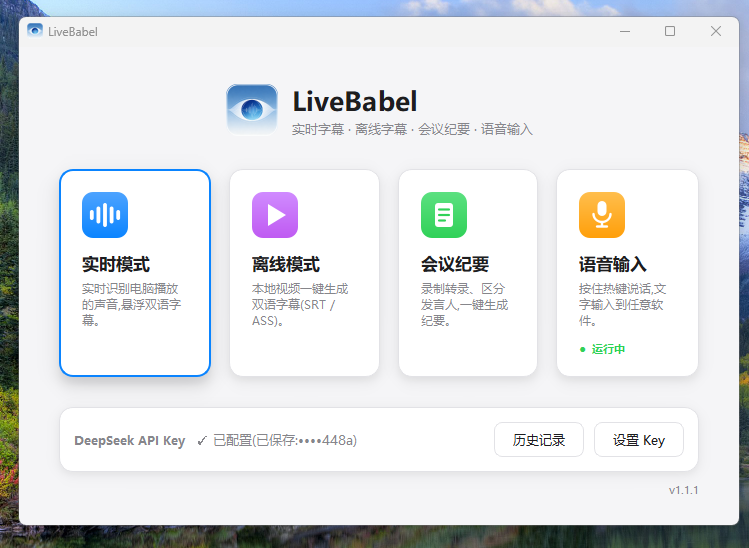
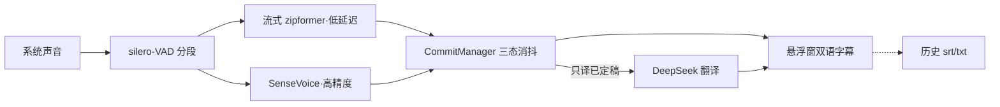
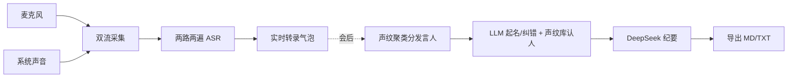

<p align="center">
  
</p>

<h1 align="center">LiveBabel</h1>

<p align="center">实时字幕 · 离线字幕 · 会议纪要 · 语音输入</p>

<p align="center">
  
  
  
  
</p>

本地优先的语音工具箱:识别全部跑本地模型([sherpa-onnx](https://github.com/k2-fsa/sherpa-onnx) / [faster-whisper](https://github.com/SYSTRAN/faster-whisper)),翻译与纪要调用 DeepSeek API。有 N 卡自动 GPU 加速,无卡自动回退 CPU。

<p align="center"></p>

## 四种模式

| 模式 | 做什么 |
|---|---|
| 🔊 **实时字幕** | 抓电脑正在播放的声音,实时识别+翻译,悬浮窗双语字幕。看直播/网课/外语视频 |
| ▶️ **离线字幕** | 本地视频生成双语 SRT/ASS,可烧录进视频,支持多文件批量 |
| 📄 **会议纪要** | 录制转录、**声纹区分说话人**、LLM 起名纠错,一键生成结构化纪要 |
| 🎙 **语音输入** | 按住 Ctrl+Alt 说话,松开即把文字输入到任意软件的光标处 |

<p align="center"></p>

## 快速开始

**下载即用(推荐)**:去 [Releases](../../releases) 下载打包版,解压双击 exe。首次运行自动下载识别模型(约 570MB,国内镜像加速)。

**源码运行**:

```bash
conda create -y -n livebabel python=3.11 && conda activate livebabel
pip install -r requirements.txt
python livebabel_gui.py
```

进主页后选模式即可;底部设置一次 DeepSeek API Key(存本地 `settings.json`,各模式共用)。

<details><summary><b>macOS</b>(macos 分支,纯 CPU)</summary>

```bash
brew install ffmpeg blackhole-2ch      # 抓系统声需 BlackHole 虚拟声卡
python3 -m venv .venv && source .venv/bin/activate
pip install -r requirements.txt
python livebabel_gui.py
```

抓系统声音:在「音频 MIDI 设置」建一个**多输出设备**(含扬声器 + BlackHole),系统输出切到它。
</details>

<details><summary><b>命令行入口</b>(进阶)</summary>

```bash
python app.py                          # 直接启动实时悬浮窗(无主页)
python app.py --input 视频.mp4          # 用文件代替系统声音
python tools/offline_subtitle.py 视频.mp4 --lang 中文 --burn    # 命令行离线字幕
```

离线常用参数:`--lang` 译文语种、`--source-lang` 源语言(默认自动检测)、`--burn` 硬压进视频、`--no-translate` 只出原文、`--device cuda` 用 GPU。
</details>

## 特点

- **字幕不抖**:volatile / provisional / committed 三态机,只翻译已定稿句,从根上消除流式 ASR 的反复改写。
- **低延迟 + 高精度**:两遍识别 —— 流式 zipformer 先出草稿抢延迟,句末 SenseVoice 整段高精度替换。
- **说话人区分**:线上会议按物理双流(我/远端)天然分开;线下单麦克风靠**声纹聚类**分出发言人,LLM 起名纠错,声纹库下次自动认人。
- **历史回看**:实时/会议自动存 `.srt` / `.txt`,主页「历史记录」可回看、删除。
- **多语种**:中 ⇄ 英 / 日 / 韩,运行中可切换。

## 分支与打包

| 分支 | 说明 |
|---|---|
| `main` | GPU 完整版(打包自带 CUDA 运行时,无卡自动回退 CPU) |
| `cpu-edition` | 纯 CPU 轻量版(不带 GPU 库,小 ~2.5GB) |
| `macos` | macOS 版(BlackHole 采集 + py2app,纯 CPU) |

```bash
packaging\build_exe.bat        # Windows GPU 版 → dist\LiveBabel\
packaging\build_exe_cpu.bat    # Windows CPU 版(cpu-edition 分支)
packaging/build_mac.sh         # macOS .app(或推 v*-mac tag 触发 GitHub Actions 云端打包)
```

<details><summary><b>工作原理</b>(实时消抖 / 会议流水线)</summary>

| 状态 | 说明 |
|---|---|
| volatile(未定稿) | 正在说的句子,会变。只显示原文,不翻译 |
| provisional(临时) | 段未结束先按子句翻一版,琥珀色,降低长句延迟 |
| committed(最终) | 句子结束,SenseVoice 整段重识+重译,青色锁定 |





会后声纹分离:VAD 门控定长窗 + 球面 K-means 聚类,按 token 时间戳精确拆分、标点吸附避免句中劈断,不依赖 torch。
</details>

<details><summary><b>模型清单</b></summary>

模型放 `models/`(不入库),首次运行自动弹窗下载,也可手动跑 `packaging\download_models.bat`:

- `silero_vad.onnx` — 语音活动检测
- `sherpa-onnx-streaming-zipformer-bilingual-zh-en-2023-02-20` — 流式 ASR(中英)
- `sherpa-onnx-sense-voice-zh-en-ja-ko-yue-2024-07-17` — 非流式高精度 ASR
- 3D-Speaker campplus / eres2net — 会议声纹区分

离线模式的 whisper 模型首次运行自动下载;放到 `models/faster-whisper-large-v3-turbo/` 可固定用本地。
</details>

## 路线图

- [x] 实时 / 离线 / 会议 / 语音输入 四模式,GPU 加速与纯 CPU 分支,macOS 适配
- [x] 声纹区分说话人(线上双流 + 线下单麦)、声纹库自动认人
- [ ] TTS 朗读(本地 ChatTTS)
- [ ] 翻译流式输出、设置面板(字体/颜色/热键)

## 许可

MIT
