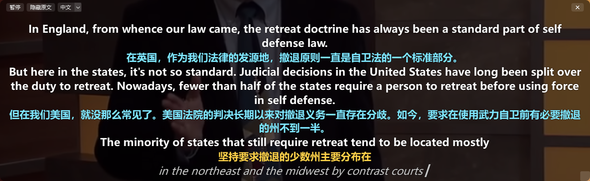
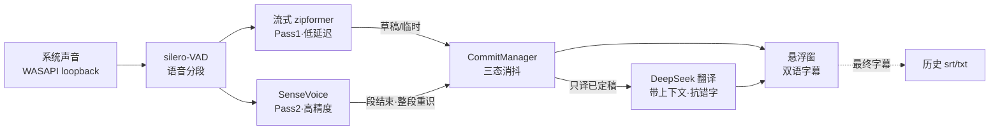
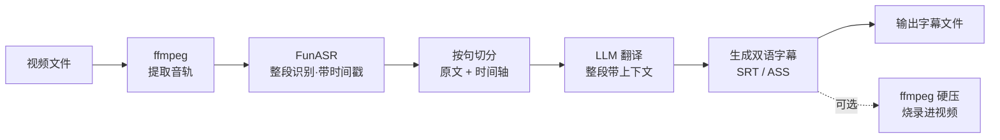

# LiveBabel · 实时双语字幕

把电脑正在播放的任何声音(视频、直播、网课、会议)**实时识别 + 翻译**,以桌面歌词式的
透明悬浮窗显示**双语字幕**。语音识别用 [sherpa-onnx](https://github.com/k2-fsa/sherpa-onnx)
本地模型,翻译调用 DeepSeek API。

> Live(实时)+ Babel(巴别塔)。看外语视频/直播时,边播边出中外双语字幕。



> 白色:英文原文 · 青色:已定稿译文 · 琥珀色:临时译文(等高精度版替换)· 灰色斜体:识别中的草稿

## 特点

- **实时双语**:抓系统声音 → 本地 ASR → LLM 翻译 → 悬浮窗双语显示。
- **字幕不抖**:流式 ASR 会反复改写草稿("晃动"),本项目用 committed/volatile 双状态机,
  只翻译已定稿的句子,从根本上消除抖动。
- **低延迟 + 高精度兼得**:两遍识别 —— 流式模型先出临时译文(琥珀色),句子结束时用非流式
  SenseVoice 整段高精度重识,替换为最终译文(青色)。长句也不用干等。
- **桌面歌词式悬浮窗**:透明置顶、可拖动缩放、鼠标悬停才显示背景和工具栏(暂停/语种/退出)。
- **多语种**:中 ⇄ 英 / 日 / 韩,运行中可切。
- **历史记录**:自动保存为 `.srt` + `.txt`。
- **英文规范化**:全大写 ASR 结果自动转自然大小写。

## 快速开始(Windows)

```bash
# 1. 建环境(需 Anaconda/Miniconda)
conda create -y -n livebabel python=3.11
conda activate livebabel
pip install -r requirements.txt

# 2. 下载模型(约 570MB,放到 models/)
packaging\download_models.bat

# 3. 运行(在项目根目录)
python app.py
```

首次运行:**右键悬浮窗 → 设置 DeepSeek API Key**(保存在本地 settings.json)。
然后播放任意视频/直播即可看到双语字幕。

> 切换音频输出设备(如插耳机)后,重启程序以重新抓取当前默认设备。

也可用一键脚本:`packaging\setup_windows.bat`(建环境装依赖)→ `packaging\run_windows.bat`(启动)。

### 打包成 exe

```bash
packaging\build_exe.bat    # 在项目根运行,产物在 dist\RealtimeSubtitle\,模型自动拷入
```

## 核心思路

| 概念 | 说明 |
|---|---|
| **volatile(未定稿)** | 当前正说的句子,会变。原文照显,不翻译 |
| **provisional(临时)** | 段未结束时按子句先翻一版(Pass1),译文琥珀色,降低长句延迟 |
| **committed(最终)** | 句子结束,SenseVoice 整段高精度重识 + 重译,替换临时版,译文青色锁定 |

分段用 silero-VAD 按真实语音/静音边界切,比流式模型的 endpoint 规则更自然、不产生静音幻觉碎段。

### 实时模式工作流程



- 流式 Pass1 先出**临时译文**(琥珀色),抢延迟;一句说完后 SenseVoice 整段**高精度重识 + 重译**,替换为**最终译文**(青色)并锁定。
- 翻译只对已定稿句触发,因此字幕不抖;上下文只取最近 3 句,prompt 大小恒定,长视频也不会膨胀。

## 目录结构

```
app.py                              # GUI 主入口(悬浮窗 + 后台流水线)
livebabel/                          # 核心包
├── overlay.py                      # PySide6 透明置顶字幕悬浮窗
├── commit_manager.py               # volatile/provisional/committed 三态管理(消抖核心)
├── translator.py                   # DeepSeek 翻译:异步、带上下文、抗同音错字、缓存
├── history_writer.py               # 字幕历史 srt+txt 落盘
├── paths.py                        # 资源路径(兼容源码 / PyInstaller)
└── asr/                            # ASR 相关
    ├── vad_engine.py               # VAD 分段 + 两遍 ASR(流式 + SenseVoice)
    ├── asr_engine.py               # 备用 endpoint 分段引擎
    ├── audio_source.py             # 文件源
    └── audio_source_windows.py     # Windows 系统声音(WASAPI loopback)
tools/                              # main.py / eval_asr.py / diag_audio.py(调试)
packaging/                          # subtitle.spec + *.bat(打包/安装脚本)
models/                             # 模型(不入库,download_models.bat 下载)
docs/                               # 截图等
```

## 模型

通过 `packaging\download_models.bat` 下载到 `models/`(不入库):

- `silero_vad.onnx` — 语音活动检测
- `sherpa-onnx-streaming-zipformer-bilingual-zh-en-2023-02-20` — 流式 ASR(中英)
- `sherpa-onnx-sense-voice-zh-en-ja-ko-yue-2024-07-17` — 非流式高精度 ASR

## 性能

CPU 上 RTF ≈ 0.1(处理速度约为实时的 10 倍),实时余量充足。延迟瓶颈在说话停顿和翻译 API,
不在推理。代码留有 GPU 口子(`VadTwoPassAsr(provider="cuda")`,需 onnxruntime-gpu)。

## 路线图

- [x] 实时模式:抓系统声音 → 两遍 ASR → LLM 翻译 → 悬浮窗双语字幕
- [x] 历史记录(srt/txt)、多语种切换、悬停工具栏、PyInstaller 打包
- [ ] **离线模式**:给视频文件离线生成双语字幕(见下图)
- [ ] 翻译流式输出(译文逐字出现)
- [ ] 设置面板(字体/颜色/位置/快捷键)
- [ ] GPU 加速(已留 `provider="cuda"` 口子)

### 离线模式(规划中)

给一个视频文件,离线生成带时间轴的双语字幕,可选硬压进视频:



> 离线场景不需要消抖(有完整音频和时间戳),质量比实时更高;翻译可复用现有
> `translator.py`,按整段+上下文一次性翻译。

## 许可

MIT
