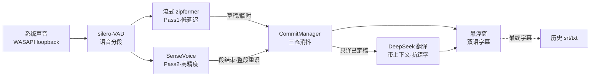
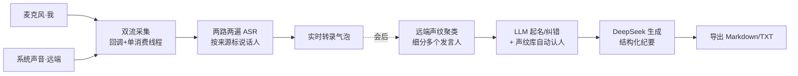
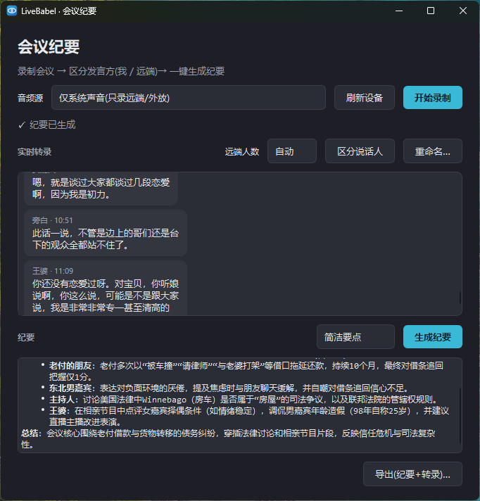
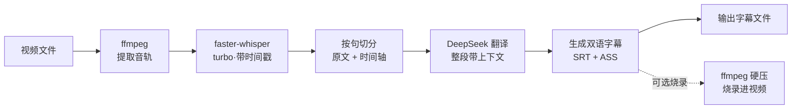
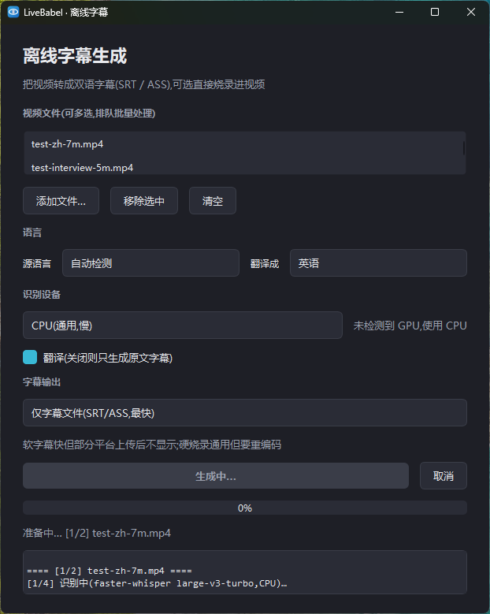

# LiveBabel · 实时双语字幕 / 离线字幕 / 会议纪要

一个本地优先的语音转写工具,三种模式一站搞定:把电脑正在播放的声音**实时识别 + 翻译**
成桌面悬浮双语字幕、给本地视频**离线生成双语字幕**、把线上/线下会议**转录并一键出纪要**。
语音识别用 [sherpa-onnx](https://github.com/k2-fsa/sherpa-onnx) / [faster-whisper](https://github.com/SYSTRAN/faster-whisper)
本地模型,翻译与纪要调用 DeepSeek API。

> Live(实时)+ Babel(巴别塔)。看外语视频/直播边播边出双语字幕;开会自动记录谁说了什么。


## 三种模式

| 模式 | 做什么 | 典型场景 |
|---|---|---|
| 🎧 **实时字幕** | 抓系统声音 → 实时 ASR → 翻译 → 透明悬浮窗双语字幕 | 看直播/网课/外语视频 |
| 🎬 **离线字幕** | 视频文件 → 双语 SRT/ASS,可烧录进视频,支持**多文件批量排队** | 给录播/影片配字幕 |
| 📝 **会议纪要** | 双流录制(我/远端)→ 实时转录 → **声纹区分说话人** → 一键生成结构化纪要 | 线上/线下会议记录 |


> 实时字幕配色:白=原文 · 青=已定稿译文 · 琥珀=临时译文 · 灰斜体=识别中草稿

## 特点

- **实时双语,字幕不抖**:流式 ASR 会反复改写草稿("晃动"),用 committed/volatile/provisional
  三态机只翻译已定稿句,从根本上消除抖动。
- **低延迟 + 高精度兼得**:两遍识别 —— 流式 zipformer 先出临时译文(抢延迟),句末用非流式
  SenseVoice 整段高精度重识替换最终译文。
- **会议说话人区分(无需 torch)**:物理双流分"我/远端";会后对远端做**声纹聚类**细分多个发言人,
  再用 LLM 起名/纠错;认识的人可存入**声纹库**,下次自动认出真名。
- **离线批量**:离线模式可一次加入多个视频排队处理。
- **GPU 开箱即用**:打包版自带 CUDA 运行时,有 N 卡自动加速,无卡自动回退 CPU。另有纯 CPU 轻量版分支。
- **历史回看**:实时/会议记录自动存 `.srt`/`.txt`,主页「历史记录」可回看、定位、删除。
- **多语种**:中 ⇄ 英 / 日 / 韩,运行中可切。

## 快速开始(Windows)

```bash
# 1. 建环境(需 Anaconda/Miniconda)
conda create -y -n livebabel python=3.11
conda activate livebabel
pip install -r requirements.txt

# 2. 下载模型(约 570MB,放到 models/)
packaging\download_models.bat

# 3. 运行图形主入口(在项目根目录)
python livebabel_gui.py
```

打开后是**主页**,选三种模式之一即可,新手无需记命令。
底部一次性设置 **DeepSeek API Key**(保存在本地 `settings.json`,三种模式共用)。

也可用一键脚本:`packaging\setup_windows.bat`(建环境装依赖)→ `packaging\run_gui.bat`(图形主入口)。

> 实时模式切换音频输出设备(如插耳机)后,需重启实时模式以重新抓取当前默认设备。

<details><summary>高级:纯命令行入口(进阶用户)</summary>

```bash
python app.py                         # 直接启动实时悬浮窗(无主页)
python app.py --input 视频.mp4         # 用文件代替系统声音预览 UI
python tools/offline_subtitle.py 视频.mp4 --lang 中文 --burn   # 命令行离线字幕
```
</details>

### 打包成 exe

```bash
packaging\build_exe.bat        # GPU 版,产物在 dist\LiveBabel\,模型/ffmpeg 自动拷入
packaging\build_exe_cpu.bat    # 纯 CPU 轻量版(不带 GPU 库,省 ~2.5G;在 cpu-edition 分支)
```

GPU 版与 CPU 版共用同一份 `subtitle.spec`,由 `LIVEBABEL_BUILD=cpu` 环境变量切换。
产物为 onedir,把整个 `dist\LiveBabel\` 文件夹分发,用户双击 exe 即用,无需装 Python/CUDA/ffmpeg。

## 核心思路(实时模式消抖)

| 概念 | 说明 |
|---|---|
| **volatile(未定稿)** | 当前正说的句子,会变。原文照显,不翻译 |
| **provisional(临时)** | 段未结束时按子句先翻一版(Pass1),译文琥珀色,降低长句延迟 |
| **committed(最终)** | 句子结束,SenseVoice 整段高精度重识 + 重译,替换临时版,译文青色锁定 |

分段用 silero-VAD 按真实语音/静音边界切,比流式模型的 endpoint 规则更自然、不产生静音幻觉碎段。

### 实时模式工作流程



### 会议模式工作流程



- 会议靠**物理双流**(麦克风=我、系统声=远端)天然区分两方,不引入 torch。
- 会后对"远端"整段做声纹聚类(VAD 门控定长窗 + 球面 K-means),把它细分成"发言人1/2/3…",
  按 token 时间戳精确拆分每个人说的话,标点吸附避免句中劈断。
- LLM 增强层做它擅长的事:给发言人起角色名、纠 ASR 同音错字、只在明显矛盾处轻改归属。
- 声纹库:开完会确认"发言人2 是张三"可存入库,下次开会高相似度自动标真名(宁可不认不认错)。



## 目录结构

```
livebabel_gui.py                    # 图形主入口(主页:实时/离线/会议)
app.py                              # 命令行实时入口(直接悬浮窗,--input 可用文件预览)
livebabel/                          # 核心包
├── launcher.py                     # 主页(选模式 + 设 Key + 历史记录入口)
├── overlay.py                      # 实时模式:PySide6 透明置顶字幕悬浮窗
├── commit_manager.py               # 实时消抖核心:volatile/provisional/committed 三态
├── translator.py                   # DeepSeek 翻译:异步、带上下文、抗同音错字、缓存
├── summarizer.py / summary_window.py  # 实时模式「总结」
├── history_writer.py               # 字幕历史 srt+txt 落盘
├── history_window.py               # 历史记录回看(列表/预览/打开文件夹/删除)
├── gui_common.py                   # 统一深色主题、对话框、暗色标题栏
├── paths.py                        # 资源路径(兼容源码 / PyInstaller)
├── ffmpeg_tool.py                  # 定位 ffmpeg
├── asr/                            # 音频采集 + ASR
│   ├── vad_engine.py               # VAD 分段 + 两遍 ASR(流式 + SenseVoice)+ GPU 探测
│   ├── audio_source.py             # 音频源抽象 + 文件源
│   ├── audio_source_windows.py     # Windows 系统声音(WASAPI loopback)
│   └── audio_source_mic.py         # 麦克风采集(会议"我")
├── meeting/                        # 会议纪要
│   ├── meeting_window.py(在上级)   # 会议页面
│   ├── pipeline.py                 # 双流采集管线(回调 + 单消费线程,防并发崩溃)
│   ├── recorder.py                 # 线程安全转录收集 + 说话人细分/重命名
│   ├── diarize.py                  # 声纹聚类(VAD门控定长窗 + 球面 K-means)
│   ├── llm_refine.py               # LLM 增强:起名/纠错/轻改归属
│   ├── voiceprint.py               # 声纹库(登记/匹配/自动认人)
│   └── minutes.py                  # DeepSeek 生成纪要 + 导出 Markdown/TXT
└── offline/                        # 离线字幕
    ├── offline_window.py(在上级)   # 离线页面(支持多文件批量队列)
    ├── transcribe.py               # faster-whisper 识别(带时间戳)
    ├── translate_batch.py          # 分批翻译(滚动上下文)
    ├── subtitle_writer.py          # 写 SRT/ASS
    ├── burn.py                     # ffmpeg 硬烧录/软封装
    └── cuda_dll.py                 # Windows 下加载 cuBLAS/cuDNN
tools/                              # offline_subtitle.py(命令行离线)/ make_logo.py
packaging/                          # subtitle.spec + *.bat(打包/安装脚本)
models/                             # 模型(不入库,download_models.bat 下载)
docs/                               # 截图等
```

## 模型

模型放在 `models/`(不入库)。实时/会议模式的 sherpa-onnx 模型用
`packaging\download_models.bat` 下载:

- `silero_vad.onnx` — 语音活动检测
- `sherpa-onnx-streaming-zipformer-bilingual-zh-en-2023-02-20` — 流式 ASR(中英)
- `sherpa-onnx-sense-voice-zh-en-ja-ko-yue-2024-07-17` — 非流式高精度 ASR
- 声纹分离模型(3D-Speaker campplus / eres2net)— 会议区分说话人用

离线模式的 whisper 模型:首次运行会自动下载到 HuggingFace 缓存;若想固定到项目里、
避免重复下载,把模型整个目录放到 `models/faster-whisper-large-v3-turbo/`,程序会优先用本地的。

## 性能

CPU 上实时模式 RTF ≈ 0.1(约为实时的 10 倍),实时余量充足;延迟瓶颈在说话停顿和翻译 API。
GPU 版打包自带 CUDA 运行时,实时/离线/声纹均可走 GPU 加速,无 N 卡自动回退 CPU。

## 路线图

- [x] 实时模式:抓系统声音 → 两遍 ASR → LLM 翻译 → 悬浮窗双语字幕
- [x] 历史记录(srt/txt)、历史回看、多语种切换、悬停工具栏、PyInstaller 打包
- [x] 离线模式:视频 → 双语 SRT/ASS,可硬压进视频;多文件批量队列
- [x] 会议纪要:双流转录 → 声纹区分说话人 → LLM 起名/纠错 → 一键纪要
- [x] 声纹库:登记认识的人,下次开会自动认出
- [x] GPU 加速(打包自带 CUDA 运行时)、纯 CPU 轻量版分支
- [ ] macOS 适配(进行中,见 `macos` 分支:BlackHole 抓系统声 + py2app 打包)
- [ ] 翻译流式输出(译文逐字出现)
- [ ] 设置面板(字体/颜色/位置/快捷键)

## 离线模式用法

给视频文件离线生成带时间轴的双语字幕(SRT + ASS),可选硬压进视频。识别用 faster-whisper
的 large-v3-turbo(99 语言、段级时间戳、不依赖 torch),翻译复用 DeepSeek。





图形界面在主页选「离线模式」即可(可批量加多个视频)。命令行:

```bash
python tools/offline_subtitle.py 视频.mp4 --lang 中文              # 生成双语 SRT+ASS
python tools/offline_subtitle.py 视频.mp4 --lang 中文 --source-lang en --burn  # 指定源语言并硬压
```

常用参数:`--lang`(译文语种)、`--source-lang`(源语言,不填自动检测)、`--burn`(硬压)、
`--no-translate`(只出原文)、`--device cuda --compute-type float16`(用 GPU)。

## 分支说明

- `main` — GPU 完整版(打包自带 CUDA 运行时,开箱即用)
- `cpu-edition` — 纯 CPU 轻量版(不带 GPU 库,体积小 ~2.5G)
- `macos` — macOS 适配(开发中,基于 cpu-edition + BlackHole 采集 + py2app)

## 许可

MIT
