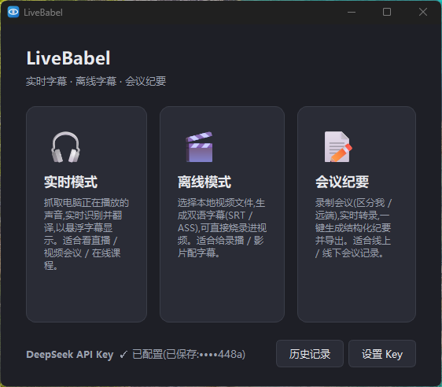
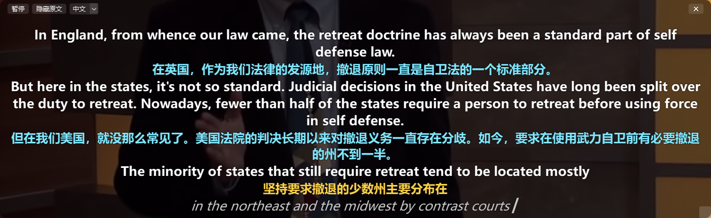
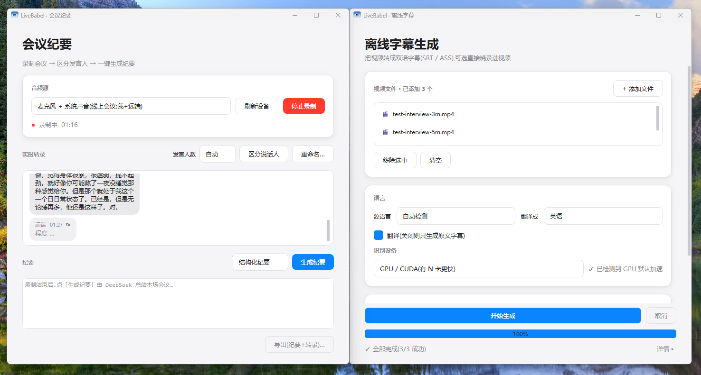
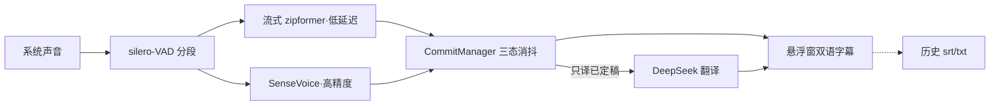
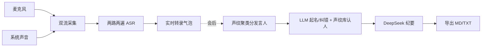

<p align="center">
  
</p>

<h1 align="center">LiveBabel</h1>

<p align="center">实时字幕 · 离线字幕 · 会议纪要 · 语音输入 · 文本朗读</p>

<p align="center">
  
  
  
  
  
</p>

本地优先的语音工具箱:语音识别与 ChatTTS 朗读全部运行在本地模型([sherpa-onnx](https://github.com/k2-fsa/sherpa-onnx)),只有翻译、纪要和可选的语音输入 AI 矫正调用 DeepSeek API。v1.4.1 回到稳定的 Zipformer + SenseVoice 两阶段路线：CPU 使用 INT8；NVIDIA GPU 上 SenseVoice/ChatTTS 使用 FP16，Zipformer 流式草稿使用当前 Windows CUDA runtime 已验证的 FP32 回退。

<p align="center"></p>

## 四种模式

### 🔊 实时字幕
抓电脑正在播放的声音,实时识别 + 翻译,悬浮窗双语字幕。看直播 / 网课 / 外语视频。

<p align="center"></p>

### 📄 会议纪要 & ▶️ 离线字幕
会议纪要:录制转录、**声纹区分说话人**、LLM 起名纠错,一键生成结构化纪要;生成后可用本地 ChatTTS 直接朗读全文。
离线字幕:本地视频生成双语 SRT/ASS,可烧录进视频,支持多文件批量。

<p align="center"></p>

### 🔈 文本朗读
会议纪要生成后可直接朗读全文。ChatTTS 会按语义分段并分块播放,长文本无需等整篇合成完成;固定说话人参数可减少逐句音色和语气跳变。朗读默认使用 CPU,首次使用时会单独询问是否下载约 470 MB 的可选模型。

### 🎙 语音输入
按住键盘右侧 Ctrl 说话,松开后整理并把最终文字输入到任意软件的光标处。目前仅支持 Windows。

语音输入托盘菜单可选开启“AI 矫正口语和错字”。开启后仅在松开热键时把最终本地识别文本发送给 DeepSeek，去除明显语气词、同音错字和识别错误；实时草稿不会联网，API 失败时自动输入原文。该功能需要 DeepSeek API Key，默认关闭。

<p align="center"></p>

## 快速开始

**下载即用(推荐)**:

- **Windows 10 / 11 64 位 CPU 版** — [LiveBabel-CPU-v1.4.1-win64.zip](https://github.com/superLin006/LiveBabel/releases/download/v1.4.1/LiveBabel-CPU-v1.4.1-win64.zip),无需 NVIDIA 显卡。
- **Windows 10 / 11 64 位 GPU 版** — 从 [ModelScope 应用包仓库](https://www.modelscope.cn/models/XHxiehuan/LiveBabel-sherpa-onnx-wheels) 下载 `LiveBabel-GPU-v1.4.1-win64.zip`，需要 NVIDIA 驱动；同仓库也提供 CPU 镜像包。
- **macOS Apple Silicon (arm64)** — 请使用 `macos` 分支构建，默认 CPU INT8。
- 完整版本说明见 [LiveBabel v1.4.1 Release](https://github.com/superLin006/LiveBabel/releases/tag/v1.4.1)。

下载后解压并运行程序。首次启动会自动下载必要的语音识别模型（CPU 约 500 MB、GPU 约 880 MB，国内镜像加速）;首次使用朗读时才会按设备另行询问是否下载 ChatTTS 模型（CPU INT8 约 470 MB，GPU FP16 约 940 MB）。模型、个人设置和历史记录均不包含在发布压缩包中。

**源码运行**:

```bash
conda create -y -n livebabel python=3.11 && conda activate livebabel
pip install -r requirements.txt
python livebabel_gui.py
```

进主页后选模式即可;底部设置一次 DeepSeek API Key(存本地 `settings.json`,各模式共用)。

<details><summary><b>macOS</b>(macos 分支,纯 CPU)</summary>

```bash
brew install ffmpeg blackhole-2ch      # 抓系统声需 BlackHole 虚拟声卡
python3 -m venv .venv && source .venv/bin/activate
pip install -r requirements.txt
python livebabel_gui.py
```

抓系统声音:在「音频 MIDI 设置」建一个**多输出设备**(含扬声器 + BlackHole),系统输出切到它。
</details>

<details><summary><b>命令行入口</b>(进阶)</summary>

```bash
python app.py                          # 直接启动实时悬浮窗(无主页)
python app.py --input 视频.mp4          # 用文件代替系统声音
python tools/offline_subtitle.py 视频.mp4 --lang 中文 --burn    # 命令行离线字幕
```

离线常用参数:`--lang` 译文语种、`--source-lang` 源语言(默认自动检测)、`--burn` 硬压进视频、`--no-translate` 只出原文、`--device cuda` 用 GPU。
</details>

## 特点

- **字幕不抖**:volatile / provisional / committed 三态机,只翻译已定稿句,从根上消除流式 ASR 的反复改写。
- **低延迟 + 高精度**:两遍识别 —— 流式 zipformer 先出草稿抢延迟,句末 SenseVoice 整段高精度替换。
- **说话人区分**:线上会议按物理双流(我/远端)天然分开;线下单麦克风靠**声纹聚类**分出发言人,LLM 起名纠错,声纹库下次自动认人。
- **历史回看**:实时/会议自动存 `.srt` / `.txt`,主页「历史记录」可回看、删除。
- **多语种**:中 ⇄ 英 / 日 / 韩,运行中可切换。
- **本地自然朗读**:会议纪要可用 ChatTTS 语义分段、分块播放,固定说话人音色;模型按需下载,CPU 使用 INT8，NVIDIA GPU 使用 FP16。

## 分支与打包

| 分支 | 说明 |
|---|---|
| `main` | 主开发分支;支持 GPU 完整版构建,正式主 Release 当前提供 Windows CPU 版 |
| `cpu-edition` | Windows 纯 CPU 打包分支,不包含 CUDA/cuDNN/TensorRT 等 GPU 运行库 |
| `macos` | macOS Apple Silicon 版(BlackHole 采集 + py2app,纯 CPU) |

```bash
packaging\build_exe.bat        # Windows GPU 版 → dist\LiveBabel\
packaging\build_exe_cpu.bat    # Windows CPU 版(cpu-edition 分支)
packaging/build_mac.sh         # macOS .app(或推 v*-mac tag 触发 GitHub Actions 云端打包)
```

<details><summary><b>工作原理</b>(实时消抖 / 会议流水线)</summary>

| 状态 | 说明 |
|---|---|
| volatile(未定稿) | 正在说的句子,会变。只显示原文,不翻译 |
| provisional(临时) | 段未结束先按子句翻一版,琥珀色,降低长句延迟 |
| committed(最终) | 句子结束,SenseVoice 整段重识+重译,青色锁定 |


```mermaid
flowchart LR
    A[系统声音] --> B[silero-VAD 分段]
    B --> C[流式 zipformer·低延迟]
    B --> D[SenseVoice·高精度]
    C & D --> E[CommitManager 三态消抖]
    E -->|只译已定稿| F[DeepSeek 翻译]
    E & F --> G[悬浮窗双语字幕] -.-> H[历史 srt/txt]
```


```mermaid
flowchart LR
    M[麦克风] & S[系统声音] --> P[双流采集] --> R[两路两遍 ASR] --> T[实时转录气泡]
    T -.会后.-> D2[声纹聚类分发言人] --> L[LLM 起名/纠错 + 声纹库认人] --> N[DeepSeek 纪要] --> X[导出 MD/TXT]
```

会后声纹分离:VAD 门控定长窗 + 球面 K-means 聚类,按 token 时间戳精确拆分、标点吸附避免句中劈断,不依赖 torch。
</details>

<details><summary><b>模型清单</b></summary>

必要的识别模型放在 `models/`(不入库、不进入发布包),首次启动会自动弹窗下载；不需要手动准备模型。

- `silero_vad.onnx` — 语音活动检测
- `zipformer/` — 流式 ASR(中英)，CPU 下载 `*.int8.onnx`；当前 Windows CUDA 流式 runtime 默认使用已验证的 FP32 图，FP16 仅在显式验证后启用
- `sense-voice/` — 非流式高精度 ASR，CPU 下载 `model.int8.onnx`，NVIDIA GPU 下载 `model.fp16.onnx`
- 3D-Speaker campplus / eres2net — 会议声纹区分

离线模式复用 SenseVoice（普通话、粤语、英语、日语、韩语），使用 Silero VAD 生成字幕时间段；Whisper 文件仍在 ModelScope 保留，供旧版 LiveBabel 使用。

ChatTTS 是独立的可选模型,不随首次启动的必要模型一起下载。首次点击朗读时按设备提示下载 CPU INT8 或 GPU FP16 版本。

模型仓库：[ModelScope · LiveBabel-Models](https://www.modelscope.cn/models/XHxiehuan/LiveBabel-Models)。CPU/GPU 图按需选择，本地不会同时保存两套大模型。

说明：NVIDIA GPU 的 SenseVoice FP16、ChatTTS FP16 已在当前 sherpa-onnx CUDA wheel 上验证；Zipformer FP16 仍受 Windows CUDA 流式 runtime 兼容性影响，程序默认使用已验证的 FP32 图，不会把未经验证的 FP16 图作为默认发布物。CPU/GPU 应用包的下载位置见 [发布包说明](packaging/RELEASE.md)。
</details>

## 路线图

- [x] 实时 / 离线 / 会议 / 语音输入四种工作模式,GPU 加速与纯 CPU 分支,macOS 适配
- [x] 声纹区分说话人(线上双流 + 线下单麦)、声纹库自动认人
- [x] TTS 朗读(本地 ChatTTS、语义分段、分块播放、固定说话人音色)
- [ ] 翻译流式输出、设置面板(字体/颜色/热键)

## 许可

MIT
